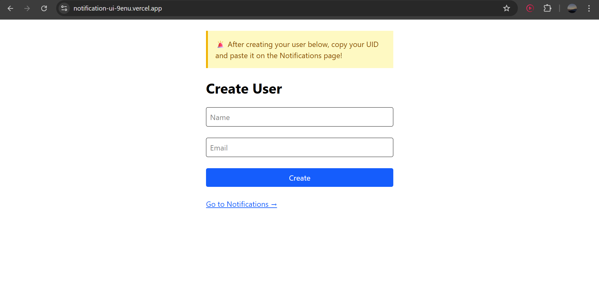
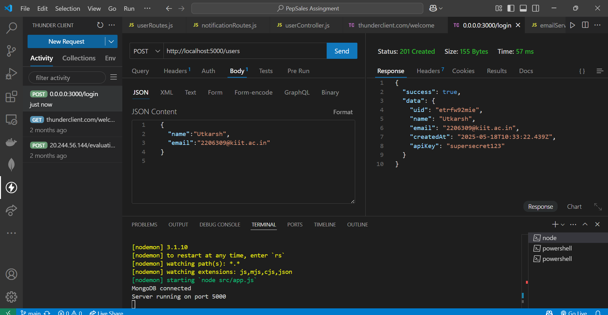
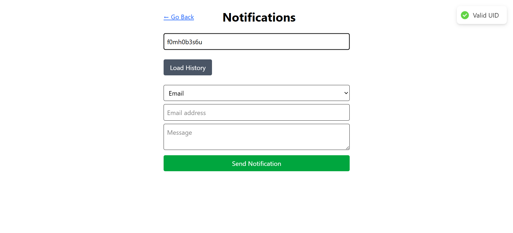
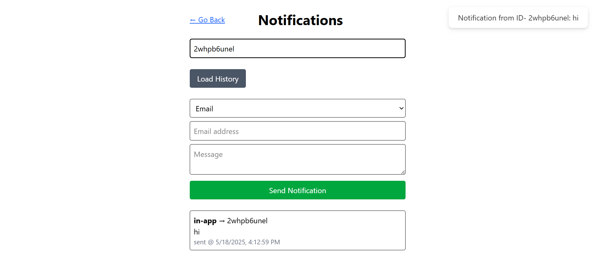

# Notification Service README

A scalable notification microservice supporting **Email**, **SMS**, and **In-App** channels with RabbitMQ-based queueing, retry logic, and real-time delivery via Socket.io. This README focuses on **API setup** and **testing** via Postman/Thunder Client or the provided UI demo.

---

## Features

- **POST /notifications** → queue email, SMS, or in-app notifications  
- **GET /users/{uid}/notifications** → fetch notification history  
- **Email** via SendGrid  
- **SMS** via Twilio  
- **In-App** real-time via Socket.io  
- **Queue processing** with RabbitMQ + retry (exponential back-off)  
- **Static API-Key** protection   

---

## 📌 Live API Endpoint

Base URL: [https://notification-service-utkarsh.koyeb.app](https://notification-service-utkarsh.koyeb.app)

All protected API routes require the header:

```http
x-api-key: <your-static-api-key>
```

The static API key is returned when you create a user (see below).

---

## 📌 Live UI Testing Endpoint

Base URL: [https://notification-ui-xy4e.vercel.app/](https://notification-ui-xy4e.vercel.app/)



You can test real-time in-app notifications by entering your UID and observing toast notifications on incoming messages.

---

## API Setup

### Prerequisites

- Node.js (v18+)  
- npm or yarn  
- RabbitMQ server (local or cloud, e.g. CloudAMQP)  
- MongoDB instance (local or Atlas)  

1. **Clone & Install**

   ```bash
   git clone https://github.com/Utkarsh-2005/PepSales-Assignment.git
   cd PepSales-Assignment
   npm install
   ```

2. **Environment Variables**
   Create a `.env` in the root with the following (replace placeholders):

   ```bash
    MONGO_URI=<your-mongodb-uri>
    TWILIO_ACCOUNT_SID=<your-twilio-sid>
    TWILIO_AUTH_TOKEN=<your-twilio-auth-token>
    TWILIO_PHONE_NUMBER=<your-twilio-phone-number>
    SENDGRID_API_KEY=<your-sendgrid-api-key>
    SENDGRID_FROM=<your-sendgrid-email>
    RABBIT_URL=<your-rabbitmq-uri>
    SOCKET_URL=<your-socket-url> # e.g., http://localhost:5000
    NOTIF_API_KEY=<your-notification-api-key>


   ```

3. **Run Server & Worker**

   ```bash
   npm start      # starts both API and worker via concurrently
   ```

   * API listens on `http://localhost:5000`
   * Worker auto-connects to RabbitMQ and MongoDB

---

## Testing the API

You can test via **Postman**, **Thunder Client**, or the **UI demo**.

### 1. Create a New User (Public)



```http
POST https://notification-service-utkarsh.koyeb.app/users
Content-Type: application/json

{
  "name": "Alice",
  "email": "alice@example.com"
}
```

* **Response** returns `uid` and `apiKey`.
* **Save** the `uid` and `apiKey` for subsequent calls.


### 2. Send a Notification


```http
POST https://notification-service-utkarsh.koyeb.app/notifications
x-api-key: supersecret123
Content-Type: application/json
```
```bash
{
  "userId": "<your-uid>",
  "type": "in-app",        # or "email", "sms"
  "to": "<recipient>",     # email, phone, or uid
  "message": "Hello world"
}
```

* **Email**: `to` = recipient’s email
* **SMS**: `to` = E.164 phone number
* **In-App**: `to` = recipient’s UID

### 3. Fetch User Notifications

```http
GET https://notification-service-utkarsh.koyeb.app/users/<your-uid>/notifications
x-api-key: supersecret123
```

* Returns array of notifications with `status` and `createdAt`.

---

## Real-Time In-App Notifications



1. **Enter your valid UID** into the **Notifications** page of the UI demo (or subscribe via Socket.io):

   * URL: `https://notification-ui-jkrv-2nmpyqlk2-utkarsh-jhas-projects.vercel.app/notifications`
   * Input your `uid` and click **Load History**; this joins your Socket.io room.

2. **Send an In-App** notification (via API or UI).

3. **Instant Toast**:



   * As soon as the worker processes the job and emits over WebSocket, your browser will show a toast:

     > \*\*Notification from ****`<sender-uid>`****: \*\***`<message>`**

No manual polling needed — real-time delivery via WebSocket.

---
## Assumptions & Decisions
1. in-app uses Socket.io rooms keyed by UID.

2. Static API-Key (no login/password) for simplicity.

3. Retries up to 5 times with exponential back-off.

4. NanoID for UID generation (10 chars)

## Notes

* **UI demo** is provided for convenience; you can fully test via API clients.
* Ensure your `x-api-key` header is present on **all** protected endpoints.

## Future Improvements

* Add unit & integration tests

* Implement JWT-based auth & roles.

* Add rate limiting (e.g. express-rate-limit).

* Add Monitoring and Alerts.

<p align="center"> Built by Utkarsh Jha </p> 


